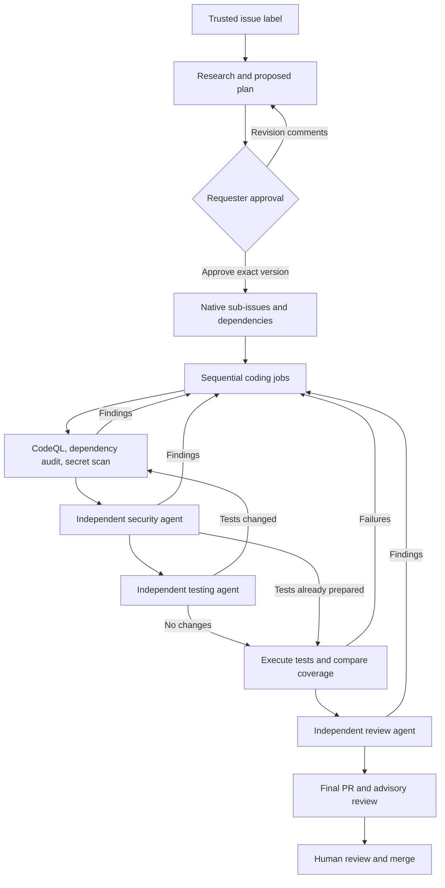

# Agentic SDLC Prototype

A GitHub-native, approval-gated delivery pipeline. Label an issue
`agentic-SDLC`; agents research it, propose a plan, implement bounded tasks,
assess security, add tests, and review the integrated feature. A deterministic
controller creates the final PR only after every required gate passes.

**Automation is disabled until configured. Nothing here automatically merges
code.** This is a single-repository, sequential prototype for Node.js/TypeScript
projects, not a production-ready guarantee of correct or secure AI output.

## Lifecycle



The original issue remains the epic. Task issues stay open until the final PR
merges; the controller's issue status comment records implementation progress.
A new plan version retires earlier tasks as not planned and starts a new branch,
preserving the previous branch and state history.

## Start Here

1. Run the local checks below.
2. Follow [GitHub setup and operations](docs/operations.md) to install a scoped
  GitHub App, configure environments, enable Copilot inference, and protect
  branches.
3. Commit and push the reviewed files to the default branch yourself. Both the
  Markdown agent workflow and its generated lockfile must be present there.
4. Set `SDLC_ENABLED` to `true` only after setup is complete.
5. Create a small issue with clear acceptance criteria, then have a repository
  writer apply the `agentic-SDLC` label.

Initial state is created only from that authorized human `labeled` event. The
controller binds the request to the event's title and body; scheduled and manual
reconciliation cannot authorize an issue that was already labeled. If the label
was applied while automation was disabled, remove it and have a writer reapply
it after enabling the controller.

The first agent posts a versioned plan on the issue and stops. The requester or
a repository writer can approve that exact version with a new comment:

```text
/sdlc approve v1
```

To change the approach, post a new comment:

```text
/sdlc revise Keep the existing API and implement only the read-only view.
```

Only standalone commands in new, unedited human comments are accepted.
Ordinary discussion does not grant approval. An approval binds to the stored
plan hash, not an editable issue comment. Editing the original issue after
planning stops execution until the request is replanned.

| Command | Who | Effect |
| --- | --- | --- |
| `/sdlc approve vN` | Requester or writer | Approve the current plan |
| `/sdlc revise <feedback>` | Requester or writer | Replan; require approval |
| `/sdlc pause` | Requester or writer | Invalidate active work and pause |
| `/sdlc resume` | Repository writer | Resume with a new job |
| `/sdlc retry` | Repository writer | Retry a blocked stage after intervention |
| `/sdlc cancel` | Requester or writer | Stop the lifecycle permanently |

Closing the issue or removing the intake label also cancels execution. Once the
feature PR exists, use normal PR review; issue commands no longer restart it.

## Local Development

Use Node.js 24.8 or newer and npm. Docker is not required locally. The hosted
Agentic Workflow uses GitHub's sandboxing on Actions runners.

```sh
npm ci --ignore-scripts
npm run verify
```

Verification runs TypeScript checking, tests with coverage enforcement, and a
build. Tests use local fixtures and mocked GitHub responses, not live writes.
Some negative fixtures deliberately run failing child tests; the outer test
runner must still finish successfully.

The agent workflow is compiled with GitHub CLI and the pinned extension:

```sh
gh extension install github/gh-aw --pin v0.88.7
npm run workflows:compile
gh aw compile sdlc-agent --actionlint
```

If the extension is already installed, verify its version before compiling.
Review and commit generated changes alongside the Markdown source. Do not edit
the generated lockfile manually. GitHub Agentic Workflows is in public preview;
compiler upgrades require deliberate review and validation.

## Implementation

| Component | Responsibility |
| --- | --- |
| [Controller](src/controller.ts) | Approval commands, state transitions, dependency scheduling, retries, publication gates |
| [Lifecycle model](src/lifecycle.ts) | Approved-plan integrity and commit-bound evidence |
| [GitHub adapter](src/github.ts) | Compare-and-swap state, task links, authenticated run discovery, restricted publishing |
| [Worker](src/worker.ts) | Validate registered jobs and package bounded proposals |
| [Validation](src/validate.ts) | Actual tests, coverage comparison, scanner-result enforcement |
| [Policy](.github/sdlc/policy.json) | File restrictions, test discovery, thresholds, and execution budgets |
| [Agent workflow](.github/workflows/sdlc-agent.md) | Fresh Copilot execution for each specialized role |
| [Check workflow](.github/workflows/sdlc-checks.yml) | Deterministic security and testing jobs |

Authoritative JSON state is stored on `sdlc-state`. Writes use the previous
content SHA to reject conflicting updates. The controller is serialized;
scheduled reconciliation recovers established lifecycles after events are
coalesced by Actions concurrency or callbacks are missed. Initial intake still
requires a live authorized label event. Jobs are persisted before dispatch and accepted only from the
configured App, trusted workflow revision, expected job, and exact source SHA.

Workers receive read-only repository credentials. They return reports and text
changes as artifacts. The separate controller validates paths, sizes, stage
permissions, regular-file types, baseline tests, and branch history before
writing through the Git Data API. It never executes candidate code or artifact
scripts. A replay after a branch write can recover the already-published commit.

Every source change invalidates earlier gate evidence. Test additions trigger
new deterministic scans and a new security-agent review before validation and
final review. The final PR includes the approved plan, task context, workflow
evidence, and an advisory `COMMENT` review. `SDLC / Complete` is attached to the
reviewed commit, not to a mutable branch name.
Agent-authored plan and evidence text has GitHub closing keywords neutralized
before publication, so only the controller-authored epic reference can close an
issue when the PR merges.

## Bounds and Limitations

- Six tasks, two automatic repair rounds, two infrastructure attempts, and
 forty total jobs per lifecycle by default. Manual retry does not reset the
 total job budget.
- Each agent execution has a 30-minute timeout and a 200-AI-credit cap. Actions
 minutes are additional. Configure organization spending controls as well.
- Coverage must reach 80% lines and 70% branches, with no drop from the baseline.
 Coverage is a minimum signal, not a substitute for meaningful assertions.
- Existing baseline test files and automation policy are immutable to agents.
 In this repository, top-level controller source files are also protected.
 To adapt the pipeline to an application, review the source/test paths and
 protections in the trusted policy through a human-controlled change.
- Text changes only, with bounded file count and bytes. No binaries, symlinks,
 submodules, cross-repository tasks, parallel integration, or automatic rebase.
- A changed default branch requires replanning against the new revision.
 Oversized or ambiguous work stops for intervention instead of expanding scope.
- Security scans are full candidate scans. Existing blocking vulnerabilities
 also prevent publication. CodeQL SARIF is retained as an artifact; it is not
 uploaded under the controller workflow's unrelated default-branch SHA.
- Agentic Workflows, scanner access, billing, and the first live issue-to-PR run
 must be verified in the configured GitHub repository. Local tests cannot
 establish those service-side permissions or entitlements.

## References

- [GitHub Agentic Workflows](https://docs.github.com/en/copilot/concepts/agents/about-github-agentic-workflows)
- [Agentic Workflow security](https://github.github.io/gh-aw/introduction/architecture/)
- [Workflow triggers and token behavior](https://docs.github.com/en/actions/how-tos/writing-workflows/choosing-when-your-workflow-runs/triggering-a-workflow)
- [Native sub-issues](https://docs.github.com/en/issues/tracking-your-work-with-issues/using-issues/adding-sub-issues)
- [Repository rulesets](https://docs.github.com/en/repositories/configuring-branches-and-merges-in-your-repository/managing-rulesets/available-rules-for-rulesets)
