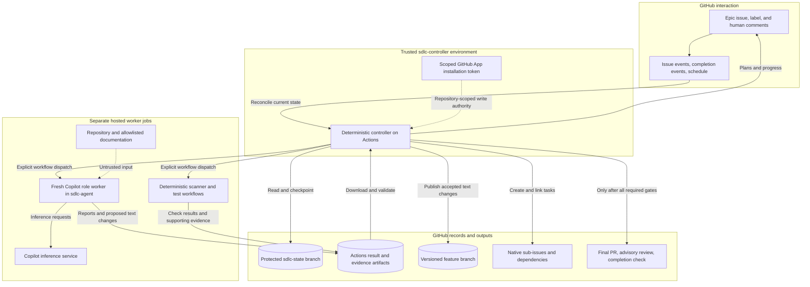
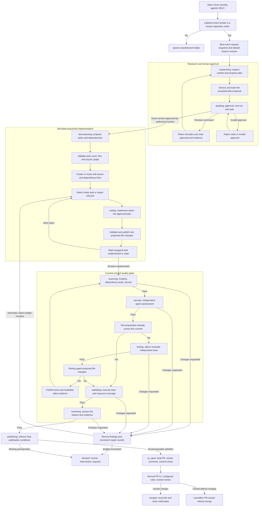
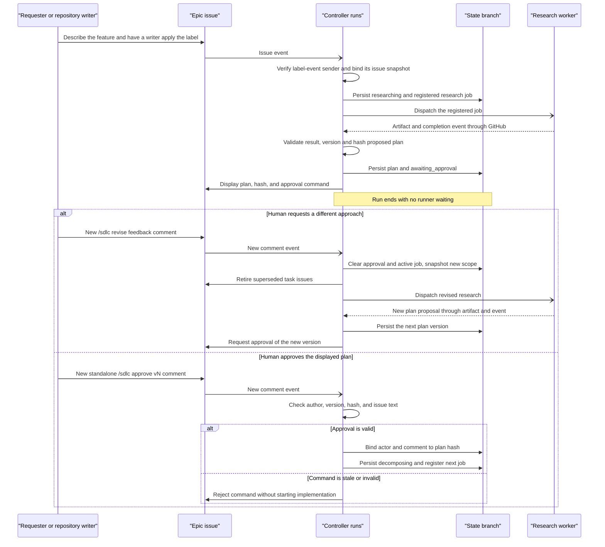
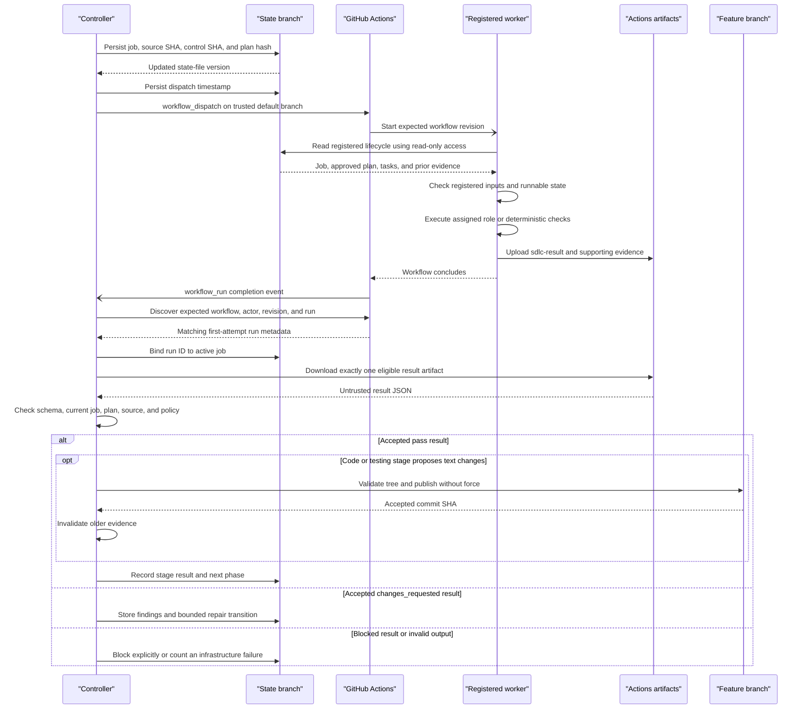
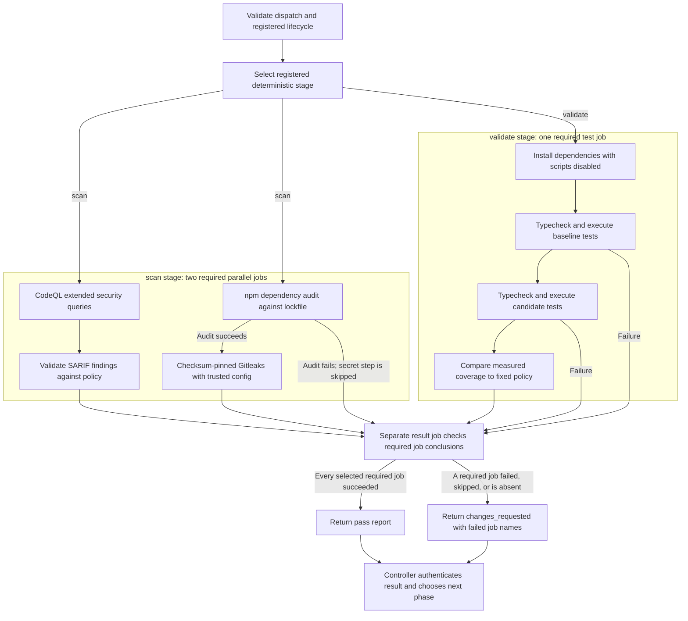
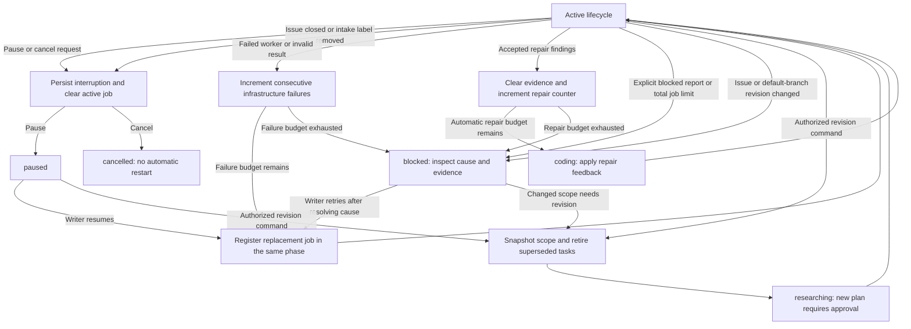
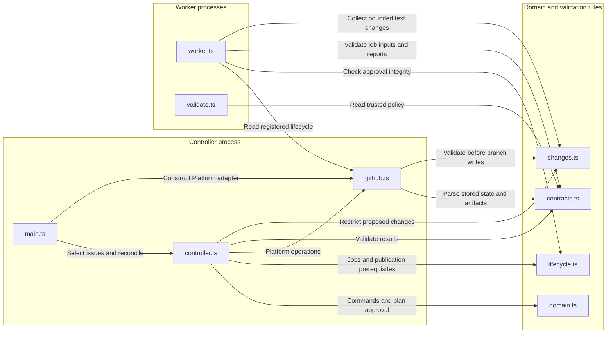

# Agentic SDLC Architecture

This document describes the implemented process from an `agentic-SDLC` issue
through research, human plan approval, task execution, security, testing,
independent review, and final PR publication. The controller makes lifecycle
decisions deterministically; agents propose plans, code, and assessments.

The scope is one GitHub repository, Node.js/TypeScript, and sequential coding
tasks. The diagrams describe implementation behavior, not proof of a successful
live deployment. See [operations.md](operations.md) for activation, credentials,
branch protection, and the first live pilot.

## Diagram Guide

- [Application Architecture](#application-architecture): services and trust zones.
- [Detailed Process Flow](#detailed-process-flow): the complete feature lifecycle.
- [Approval Conversation](#approval-conversation): requester decisions and revisions.
- [Worker Handoff](#worker-handoff): dispatch, artifacts, and result acceptance.
- [Security and Testing](#security-and-testing): deterministic gate execution.
- [Recovery Flow](#recovery-flow): pauses, repairs, retries, and cancellation.
- [Component Relationships](#component-relationships): implementation ownership.
- [State and Evidence](#state-and-evidence): durable records and publication rules.

Solid arrows show control or data flow. Dotted arrows show credentials or
supporting context. A gate's outgoing edge labels state the decision; agents
cannot choose an unauthorized transition merely by requesting it.

## Application Architecture

Everything runs through GitHub Actions and GitHub APIs. There is no locally
hosted controller, separate webhook receiver, database server, or message broker.

<!-- mermaid-checked: safe quoted labels, unique IDs, closed subgraphs -->

### Technology Stack

| Layer | Technology | Version | Purpose |
| --- | --- | --- | --- |
| Control | Node.js | 24.8+ | Run the controller and validators |
| Source | TypeScript | Pinned | Model state and API contracts |
| Agents | gh-aw and Copilot | gh-aw v0.88.7 | Compile and run role workers |
| API | Octokit | Pinned | Access GitHub REST APIs |
| Contracts | Zod | Pinned | Validate state and worker reports |
| Evidence | Actions artifacts | Managed | Transfer reports between runs |
| Security | CodeQL, npm audit, Gitleaks | Pinned where applicable | Scan code |
| Testing | Node test runner and c8 | Pinned where applicable | Test and cover |

State and source changes are stored in separate Git branches. GitHub Issues
provides the human interface, while Actions artifacts carry worker output.
Copilot inference, npm advisories, and allowlisted documentation are external
dependencies; unavailable services do not automatically waive a gate.

### Key Decisions

- **Separate reasoning from authority.** Workers have read-only repository
  access. Only the controller receives the App token used for publishing.
- **Keep state outside the conversation.** Versioned JSON is authoritative;
  comments are commands, proposed-plan displays, or progress projections.
- **Publish the PR last.** Intermediate work lives on a feature branch. Agent
  review precedes PR creation; its native `COMMENT` review is attached afterward.

The hosted agent runtime uses sandbox containers. Local development and
documentation rendering do not require Docker. Deterministic check jobs are
separate Actions jobs, not additional Copilot agents.

## Detailed Process Flow

The labels `researching`, `awaiting_approval`, and so on are persisted lifecycle
phases. Transitions below assume the worker result has passed the acceptance
checks described in [Worker Handoff](#worker-handoff).

<!-- mermaid-checked: safe quoted labels, unique IDs, closed subgraphs -->

Important details behind the diagram:

1. A lifecycle is created once per issue. Relabeling or reopening does not
   restart a permanently cancelled lifecycle.
2. Task selection uses the first incomplete task whose dependencies are all
   implemented. There is one registered active job per lifecycle, even when
   multiple tasks are independent.
3. The controller records a testing-stage result on the commit containing the
   accepted tests. It then reruns scanning and security, preserving that new
   test-preparation evidence so testing does not loop indefinitely.
4. Any subsequent code change clears earlier evidence. Repair feedback also
   clears evidence, even when a repair later produces no file changes.
5. Tasks marked implemented in state remain open as GitHub issues until merge.
   The final PR contains `Closes #<epic-number>`; GitHub handles epic closure
   on merge to its default branch, and reconciliation closes child tasks.
6. Invalid output, missing artifacts, pauses, and scope drift follow the
   separate [Recovery Flow](#recovery-flow), not an unconditional success edge.

## Approval Conversation

Approval is an issue-comment protocol, not a model-generated decision and not
a runner waiting for keyboard input. Each event starts a short controller run.

<!-- mermaid-checked: quoted participant aliases, closed conditional blocks -->

Only new, unedited human comments with standalone recognized commands are
processed, once per comment ID. The requester may approve or revise after
trusted intake, even if they are not a repository writer. Writers may also
approve. Commands from other users are ignored; valid authors receive rejection
feedback for invalid state or stale versions.

A first lifecycle can only be created from an authorized human label event, not
from a later schedule or manual reconciliation. If the issue changes after that
event, the event snapshot remains authoritative and execution blocks before a
worker is dispatched. A revision snapshots the current issue and default branch, invalidates the
active job, clears approval and evidence, retires existing tasks as not planned,
and chooses a new versioned feature branch. Older branches are retained.
An edited issue or changed default branch requires replanning before execution
can continue; `/sdlc retry` does not authorize changed scope.

## Worker Handoff

Both agent and deterministic workers use the same durable job protocol. A
completion event is only a reconciliation hint, not sufficient proof that the
result belongs to the lifecycle.

<!-- mermaid-checked: quoted participant aliases, closed conditional blocks -->

The adapter selects the expected worker file from the registered stage:

- `research`, `decompose`, `code`, `security`, `test`, and `review` use the
  [compiled agent workflow](../.github/workflows/sdlc-agent.lock.yml).
- `scan` and `validate` use the
  [deterministic check workflow](../.github/workflows/sdlc-checks.yml).

Acceptance requires the controller App as the run actor, the registered trusted
workflow commit, the expected job name and workflow, and `run_attempt == 1`.
The report supplies `jobId` and `inputSha`; stage, task, and plan authority come
from the registered job, not arbitrary fields supplied by an agent.

The controller accepts one unexpired `sdlc-result` artifact, with bounded
compressed and result-file sizes. It parses `result.json` as data and never
executes downloaded code. Agent proposals remain untrusted even when their
workflow provenance matches.

For deterministic checks, the dedicated `SDLC Check Result` job must succeed.
That job can report a failed scanner or test even when the overall workflow
conclusion is `failure`. A failed agent workflow has no equivalent exception.

## Security and Testing

Security uses ordinary tools in addition to agent reasoning. Coverage is
measured by executing tests, not by accepting a model's estimated percentage.

<!-- mermaid-checked: safe quoted labels, unique IDs, closed subgraphs -->

`scan` requires `prepare`, `codeql`, and `security`. `validate` requires
`prepare` and `tests`; jobs for the other stage are intentionally not required.
If preparation fails, the result job cannot produce an accepted report.

The current checks include:

- **CodeQL:** JavaScript/TypeScript, `security-extended` queries, and build mode
  `none`. SARIF is evaluated locally and retained as an artifact, not uploaded
  against the workflow's unrelated default-branch commit.
- **Dependencies:** npm audits the candidate lockfile and blocks high or
  critical vulnerabilities. Failed or malformed audit output cannot pass.
- **Secrets:** Gitleaks v8.30.1 uses a checksum-pinned binary and trusted
  configuration. Findings block the gate; source-controlled ignore files and
  inline allow comments cannot suppress them in this workflow.
- **Tests:** baseline and candidate dependencies are installed without npm
  lifecycle scripts. A trusted runner invokes TypeScript and Node tests with
  c8, using test and source patterns from policy.
- **Coverage:** at least 80% lines and 70% branches, with no permitted drop from
  the baseline. Missing tests or invalid coverage data fail validation.

The security and final review agents assess the complete integrated diff and
available evidence. They are advisory assessments with limited tool access,
not proof that a feature is free of defects. Native GitHub rules and human
review remain necessary at the PR boundary.

## Recovery Flow

The controller records state before dispatching work or invalidating a job.
Only recognized, current results can advance a running lifecycle.

<!-- mermaid-checked: safe quoted labels, unique IDs, closed subgraphs -->

### Recovery Rules

- **Duplicate events:** reuse the issue lifecycle and active job. Commands are
  deduplicated by comment ID; repeated side effects reuse controller-owned
  markers or existing linked resources.
- **Lost dispatch:** wait up to 10 minutes for a matching run, then allow one
  additional dispatch of the same job identity. Exhaustion counts as an
  infrastructure failure; a replacement job receives a new identity.
- **Timeout:** after 90 minutes from job creation, reconciliation cancels an
  unfinished run and counts a failure. Agent and check jobs have their own
  shorter Actions time limits.
- **Infrastructure failures:** two consecutive failures block the lifecycle.
  Successful results reset this counter. A missing or malformed scanner report
  is not a clean scan.
- **Artifact retrieval:** transient `404`, `408`, `429`, rate-limited `403`, and
  `5xx` responses, plus an empty result-artifact listing, retain the completed
  registered job for retry until its job timeout. Persistent retrieval failure
  then consumes one infrastructure failure.
- **Repair findings:** accepted `changes_requested` after decomposition return
  to coding, with two automatic repair rounds. The same outcome from research
  or decomposition counts as a failed stage instead.
- **Manual controls:** requester or writer may pause, revise, or cancel.
  Only a writer may resume or retry. Retry clears infrastructure failures, not
  the total-job or repair counters, and cannot bypass unchanged prerequisites.
- **Late output:** interruption clears the active job before requesting worker
  cancellation. A late artifact does not authorize its own acceptance.
- **Partial publication:** if a commit was written before interruption, recovery
  verifies its parent, proposal digest, and complete expected file tree. A
  matching commit message alone is insufficient.
- **State races:** updates include the prior state-file SHA. Conflicting writes
  fail instead of silently overwriting another checkpoint. A future controller
  run reloads state; GitHub API calls and state writes are not one transaction.

The schedule reconciles every 10 minutes and can recover established lifecycles
after events are coalesced by Actions concurrency. Initial lifecycle creation
still requires a live authorized label event. Manual dispatch can reconcile one
issue or all known lifecycles. Turning `SDLC_ENABLED` off prevents new starts and transitions, but
already-running jobs must also be cancelled for an immediate emergency stop.

Once `pr_open` is reached, normal PR review owns further interaction. The
controller observes merge or closure; it does not autonomously respond to PR
review comments or rerun the lifecycle for subsequent PR pushes.

## Component Relationships

These are modules within Actions jobs, not separately deployed services.
`Platform` is the controller's boundary for GitHub effects and local test fakes.

<!-- mermaid-checked: safe quoted labels, unique IDs, closed subgraphs -->

### Component Inventory

| Component | Layer | Type | Responsibility |
| --- | --- | --- | --- |
| [Entry](../src/main.ts) | Control | CLI | Select issues and reject stale runs |
| [Controller](../src/controller.ts) | Control | Orchestrator | Reconcile stages |
| [Domain](../src/domain.ts) | Domain | Rules | Parse commands and hash plans |
| [Lifecycle](../src/lifecycle.ts) | Domain | Ledger | Jobs, tasks, evidence |
| [Contracts](../src/contracts.ts) | Validation | Schemas | Parse untrusted data |
| [Changes](../src/changes.ts) | Validation | Policy | Restrict paths and sizes |
| [GitHub](../src/github.ts) | Effects | Adapter | State and repository writes |
| [Worker](../src/worker.ts) | Execution | CLI | Prepare and package results |
| [Validator](../src/validate.ts) | Execution | CLI | Run tests and enforce gates |

## State and Evidence

### Domain Records

| Record | Meaning and relationship |
| --- | --- |
| Epic | Original request and human discussion; owns one lifecycle |
| Plan | Versioned proposed scope; implementation needs its approval |
| Approval | Human actor and comment bound to an exact plan hash |
| Task | Bounded work item in the approved plan's dependency graph |
| Job | One registered attempt to execute a stage against a commit |
| Evidence | Accepted stage summary and run reference for one commit |
| Feature PR | Published integrated feature, awaiting normal human review |

State is stored as `issues/<number>.json` on the protected `sdlc-state` branch.
That branch is initialized with an isolated root commit, separate from feature
history. The default feature branch pattern is `agentic/epic-<number>-v<version>`;
the branch is created lazily when the first accepted text change is published.

### Revision Bindings

| Binding | Purpose |
| --- | --- |
| `baseSha` | Baseline source and tests for this plan's implementation |
| `controlSha` | Trusted workflow and automation revision |
| `headSha` | Latest controller-accepted feature commit |
| `plan.hash` | Immutable plan content and version fingerprint |
| `job.inputSha` | Source commit supplied to a particular worker |
| `job.runId` | Accepted GitHub run for the registered job |

At initialization, approval, and replanning, baseline and controller SHAs are
captured from the default branch. `baseSha` then remains fixed while the
candidate head advances. Dispatch inputs carry the issue, job, stage, candidate
SHA, and controller SHA.

`controlSha` tracks the default branch rather than pinning one commit for the
whole lifecycle, because `workflow_dispatch` always runs at the head: a pin left
behind by unrelated commits would fail every worker's revision gate and stall the
lifecycle silently. Between registered jobs the controller compares its pinned
revision with the current head and adopts the head when no protected path
differs. A protected-path difference means the trusted harness itself moved, so
the lifecycle is blocked for replanning instead. Anything the comparison cannot
judge cleanly — a revert, a force push, or a diff at the API's file cap — is
treated as a protected-path change. The protected set is the one in
`policy.json`, so the paths agents may not write are exactly the paths whose
movement invalidates their work.
The persisted job links those inputs to the approved plan and selected task.

### Publication Preconditions

Before creating the final PR, the controller requires:

1. An intact plan whose hash matches the recorded human approval.
2. Phase `publishing`, no active job, and at least one task.
3. Every task marked implemented and a head commit different from the baseline.
4. Accepted `scan`, `security`, `test`, `validate`, and `review` evidence on the
   exact candidate head SHA.
5. The working branch still pointing to that reviewed commit.

Publication creates or reuses the feature PR, posts the reviewer's report as an
advisory `COMMENT`, and publishes `SDLC / Complete` on the reviewed SHA. The App
does not approve or merge the PR. Configured branch rules, normal CI, and human
review govern merging. Selecting the App as the required check's expected
source is an installation step, not something these workflows configure.

### Retention and Limits

| Control | Current value |
| --- | --- |
| Tasks per plan | 6 |
| Automatic repair rounds | 2 |
| Dispatch attempts per job | 2 |
| Consecutive infrastructure failures before blocking | 2 |
| Total registered jobs per lifecycle | 40 |
| Changed files per proposal | 30 |
| Total proposed text bytes | 512,000 |
| Agent execution timeout | 30 minutes |
| Agent job timeout | 45 minutes |
| Controller timeout | 15 minutes |
| Agent inference cap | 200 AI credits per run |
| Worker evidence artifact retention | 14 days requested |

Limits come from [policy](../.github/sdlc/policy.json) and the workflow sources.
State history and issue/PR summaries retain evidence links, not perpetual copies
of expired artifacts. Actions minutes and aggregate inference usage need
separate billing controls.

## Trust Boundaries and Scope

The controller's App key belongs only to the `sdlc-controller` environment.
Agent inference credentials belong to `sdlc-agent`; they do not grant the
controller's repository publishing authority. The CodeQL job has scoped
`security-events: write`, but no controller App token and no candidate build.
Candidate tests run in separate jobs without publishing credentials.

File policy is enforced outside the model: only coding and testing may propose
changes, and testing may only modify test paths. Protected automation paths,
baseline tests, unsafe paths, case-colliding path segments, symlinks, binary
data, oversized changes, and conflicting branch history are rejected. Worker role instructions provide
behavioral guidance; merely reading a role profile does not create a separate
operating-system permission boundary between roles.

Compiler-generated agent post-processing has no issue, content, pull-request,
check, deployment, package, or security-event write permission. Its isolated
`actions: write` grant is used only by pinned framework code for the daily
AI-credit cache; agent-selected safe outputs cannot use it for repository
mutation. Plan and evidence Markdown is treated as untrusted and issue-closing
keywords are neutralized before the controller builds the final PR.

The current prototype does not implement parallel coding integration, automatic
rebasing, cross-repository changes, deployment, automatic merging, or a Projects
dashboard. The public-preview agent runtime and all live permissions still
need a bounded pilot. Local fixtures and tests validate controller behavior;
they cannot guarantee model correctness or prove service-side configuration.
